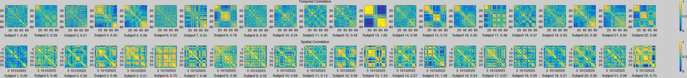
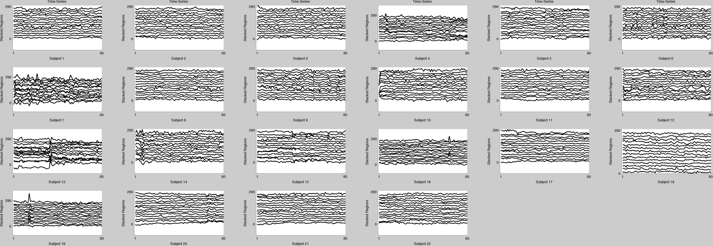
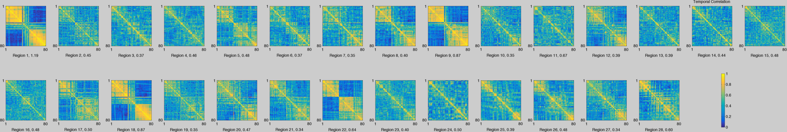

connectivity-diagnostics
========================

A set of scripts for visual and quantitative checks of data based on spatio-temporal correlation structure in fMRI data.

Also includes a package to estimate robust covariance matrices.

Usage
-----

```
[score_t score_s score_p h1 h2 h3] = plot_correlations(Xdata(:,new_idx,:));

figure(h1.figure)
export_fig([opts.outputFiles{ii} '_datacheck_subjects.png'])
figure(h2.figure)
export_fig([opts.outputFiles{ii} '_datacheck_regions.png'])
figure(h3.figure)
export_fig([opts.outputFiles{ii} '_datacheck_time.png'])


```

Remarks
-------

The influence scores only detect outliers. If the majority of the subjects or regions share the same issues, then the scores do not necessarily give you valuable information. A visual inspection might help flag such cases.

Thus a low influence score (< .5) does not necessarily mean all is okay, but modest scores of (.75-1) are worth inspecting and those (>1) are definitely worth checking for motion, alignment or registration issues. In particular large blocks of high temporal correlation seem to indicate motion. See screenshot for examples.







Dependencies
------------

Needs the ggmClass which has been added as a submodule in ggm-external
